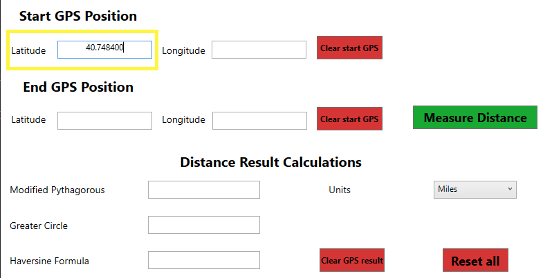
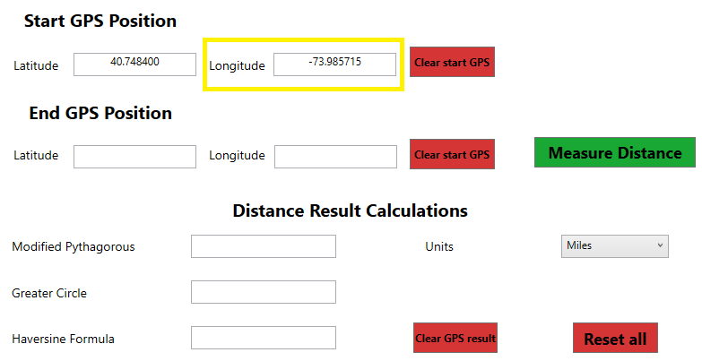
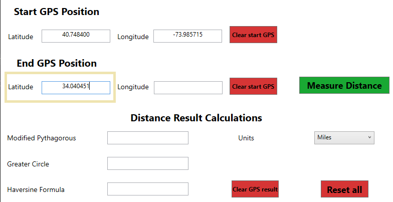
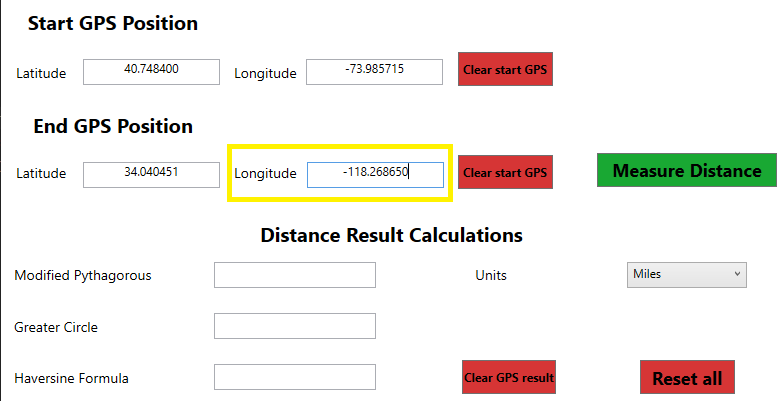
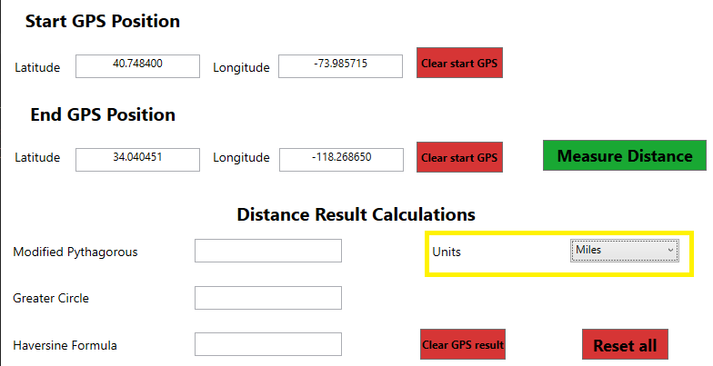
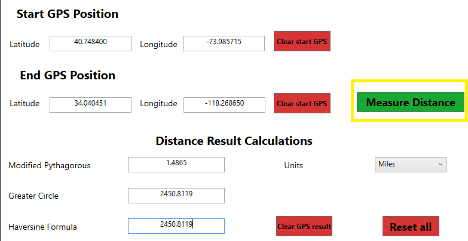
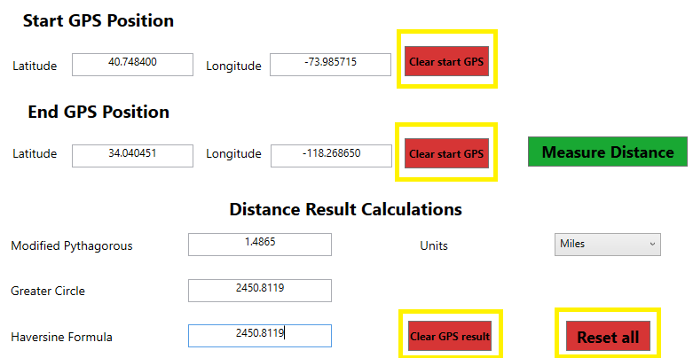

# Basic Usage

To start you will need to find the GPS coordinates of the 2 locations you want to measure the distance between. One easy way is to use [Google Maps](https://maps.google.com).

## Adding the coordinates
Input the latitude of the first location here  

Input the longitude of the first location here  

Input the latitude of the second location here  

Input the longitude of the second location here  

## Selecting units

Next you can select your units in miles, kilometers or meters  

## Results

You are now ready for your results! Click the big green button to view them.  

## Clearing

If you'd like you can clear your results with these buttons.  
